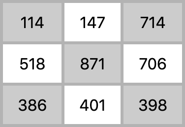

# Обход матрицы по спирали

## Задача

### Дано:

`n` — целое от `1` до `∞`

### Требуется:

Сгенерировать матрицу со сторонами `2n-1` заполненную произвольными числами (или натуральным рядом).
Вывести все числа по порядку, пройдя из центра по спирали против часовой стрелки.

### Пример матрицы (для `n = 2`):



### Результат для данного примера:
```
871, 518, 386, 401, 398, 706, 714, 147, 114
```

Язык — Javascript. Результат опубликовать.

## Решение

Опубликовано на [этой странице](https://firefoxic.github.io/spiral-matrix/).

**Пояснение:** использована только библиотека lit-html и только для вывода данных на страницу (шаблонизация).
